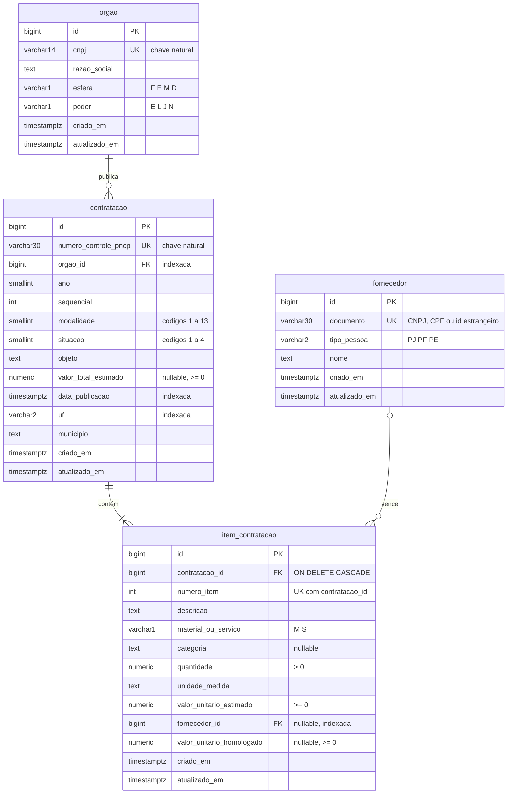

# Modelo relacional — camada silver

Banco transacional normalizado, no schema `silver` do PostgreSQL. É criado pela migração
[`0001_schema_inicial.py`](../backend/alembic/versions/0001_schema_inicial.py), a partir dos
modelos em [`models.py`](../backend/src/radar/adapters/postgres/models.py).

## Diagrama

Como ler as linhas: `||--o{` = "um para zero ou muitos"; `||--|{` = "um para um ou muitos";
`|o--o{` = "zero ou um para zero ou muitos" (o item pode não ter vencedor ainda).

## Restrições de integridade

| Tabela | Restrição | Para quê |
|---|---|---|
| todas | `PRIMARY KEY (id)` com `IDENTITY` | Chave substituta gerada pelo banco, usada nas FKs |
| `orgao` | `UNIQUE (cnpj)` | Idempotência: o mesmo órgão nunca entra duas vezes |
| `fornecedor` | `UNIQUE (documento)` | Idem, para fornecedores |
| `contratacao` | `UNIQUE (numero_controle_pncp)` | Idempotência da ingestão do PNCP |
| `item_contratacao` | `UNIQUE (contratacao_id, numero_item)` | Um número de item por contratação |
| `contratacao` | `FK orgao_id → orgao` (RESTRICT) | Não dá para apagar órgão que tem contratação |
| `item_contratacao` | `FK contratacao_id → contratacao` (CASCADE) | O item não existe sem a contratação |
| `item_contratacao` | `FK fornecedor_id → fornecedor` (RESTRICT) | Não dá para apagar fornecedor que venceu item |
| `contratacao` | `CHECK modalidade IN (1..13)`, `situacao IN (1..4)` | Só códigos válidos do PNCP |
| `contratacao`, `item_contratacao` | `CHECK` valores `>= 0`, `quantidade > 0` | Defesa em profundidade (o domínio já valida) |
| `item_contratacao` | `CHECK (fornecedor_id IS NULL) = (valor_unitario_homologado IS NULL)` | Resultado completo ou ausente |

## Normalização

- **1FN**: todo campo é atômico (nada de lista de itens numa coluna) e cada tabela tem chave primária.
- **2FN**: em `item_contratacao`, os dados do item dependem da chave inteira
  (`contratacao_id`, `numero_item`), e não só de parte dela. Os dados da contratação
  (objeto, órgão) ficam em `contratacao`, e não repetidos em cada item.
- **3FN**: nenhum campo depende de outro campo que não seja chave. A razão social do órgão
  fica só em `orgao`; a contratação guarda apenas o `orgao_id`. O nome do fornecedor fica
  só em `fornecedor`.

**Desnormalizações conscientes:**
- `ano` e `sequencial` em `contratacao` podem ser derivados do `numero_controle_pncp`. Ficam
  gravados porque filtrar por ano é comum, e extrair de um texto em toda consulta é lento
  e não usa índice.
- `valor_total` do item **não** é gravado (é `quantidade × valor_unitario_estimado`); assim
  ele nunca fica inconsistente. O dbt calcula quando precisar.

**Limitação conhecida:** o resultado do item (fornecedor + preço homologado) fica no próprio
item, o que supõe **um vencedor por item**. O PNCP permite, raramente, mais de um resultado
por item. Se isso aparecer nos dados reais, o resultado vira uma tabela própria
(`resultado_item`), numa nova migração. Ver [ADR 0002](adr/0002-dominio-separado-do-orm.md).
